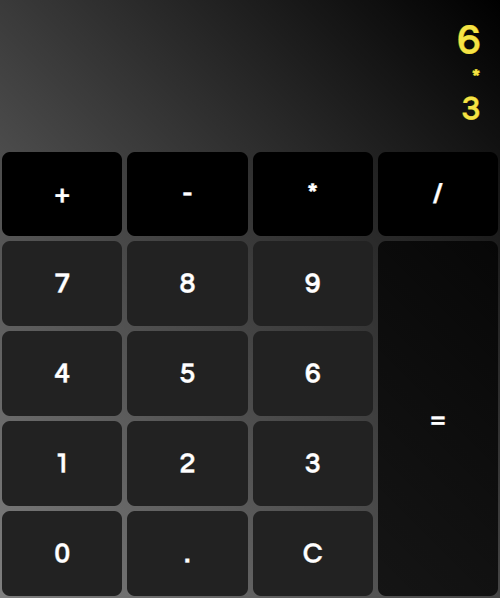

# React Calc

Una calcolatrice scritta in React, da una persona che non sa usare React.

Ne ho realizzato un [clone in Angular](https://github.com/belelabestia/calc-ng).



## Specifica

Ricalca il funzionamenteo della calcolatrice Standard di Windows, limitandosi alle seguenti funzioni:

### Operazioni

Operazioni supportate:

- Addizione
- Sottrazione
- Moltiplicazione
- Divisione

### Uguale

L'uguale continua a ripetere l'ultima operazione se ripetuto.

### Cancella

Il tasto cancella azzera tutto.

## Uso

Richiede:

- Node.js
- Git

```
git clone https://github.com/belelabestia/react-calc.git
cd react-calc
npm i
npm start
```

## Osservazioni

- Non so usare React
- Avevo sottovalutato la complessità di una calcolatrice base
